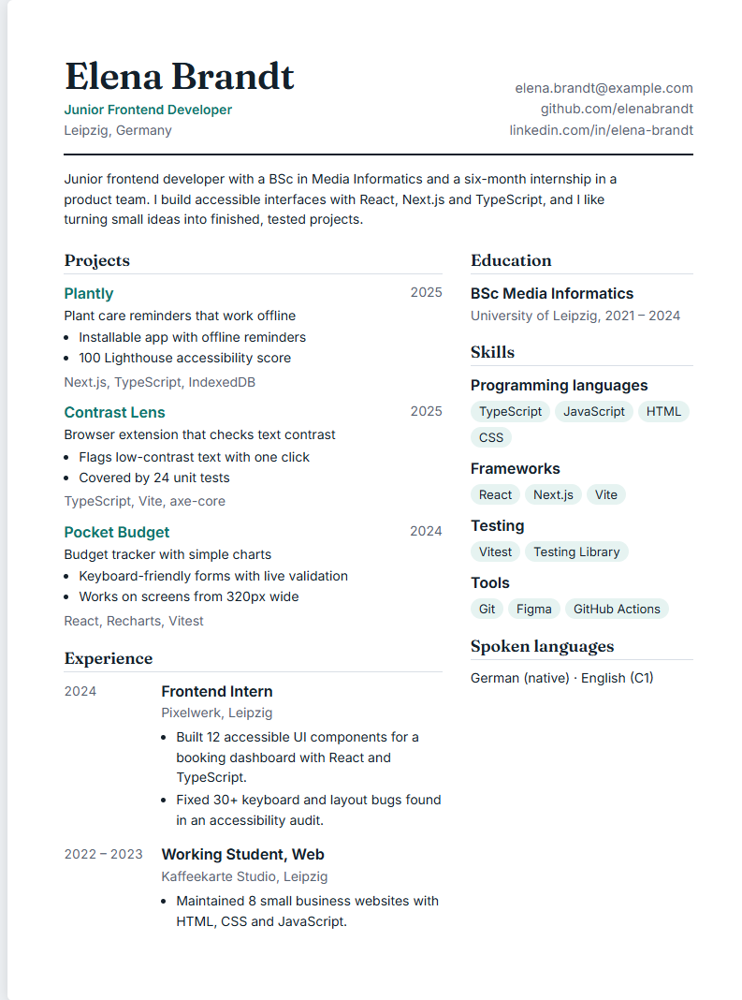
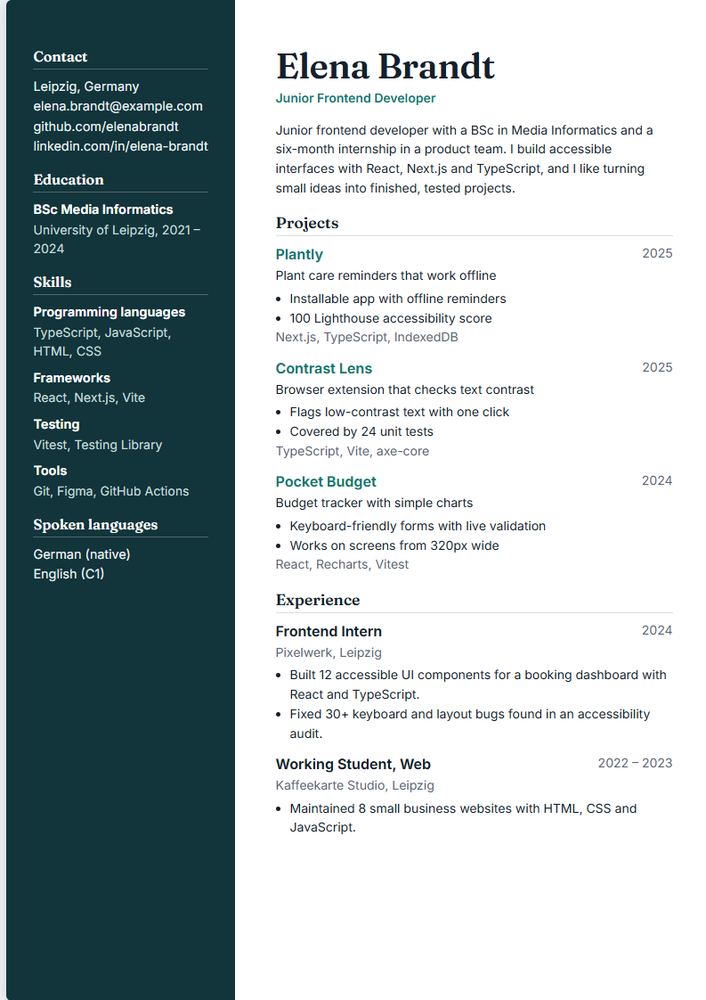
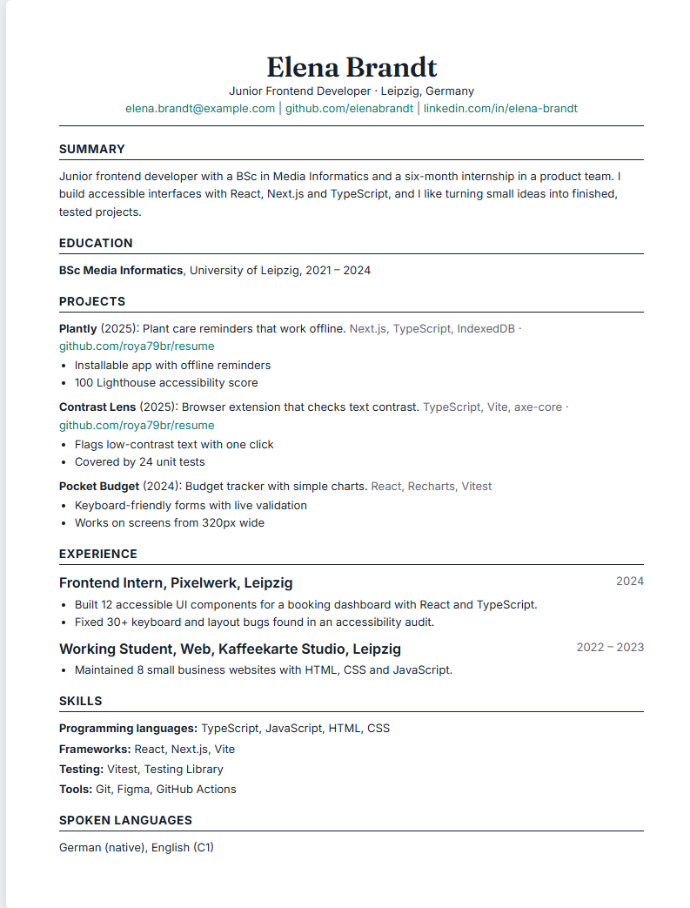
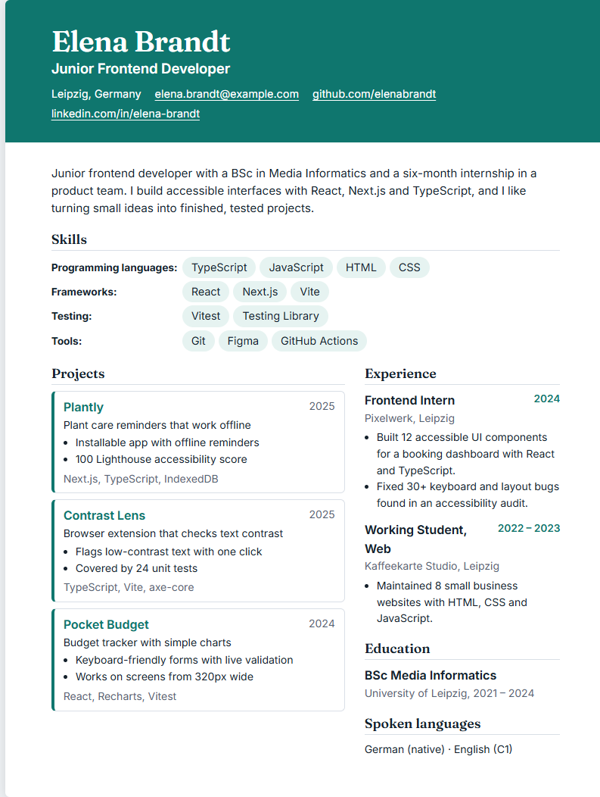

# Resume Pro

A resume website built with Next.js. One set of data, four ready-made layouts, a light and dark theme, and a print-ready A4 page for saving as a PDF.

**Live demo:** https://roya79br.github.io/resume/

> The person in the demo (Elena Brandt) and all her data are fictional. The project itself is the point: it shows how I structure, style, test and ship a small front-end app.

## Screenshots

| Classic | Modern |
| --- | --- |
|  |  |

| Compact | Bold |
| --- | --- |
|  |  |

## Features

- **Four templates** that share the same data. Compact is a single-column layout made to be easy for applicant tracking systems (ATS) to read.

  | Template | Route | Look |
  | --- | --- | --- |
  | Classic | `/` | Two columns with a year column |
  | Modern | `/templates/modern` | Dark sidebar |
  | Compact | `/templates/compact` | Single column, ATS-friendly |
  | Bold | `/templates/bold` | Accent colour header |
- **Light and dark theme** for the page around the resume.
- **Save as PDF** from the browser. The Download PDF button opens the print dialog, and a print stylesheet gives each template a clean A4 layout. Turn off "Headers and footers" in the dialog for a clean result.
- **Project pages** at `/projects/<slug>`, created from the same data.
- **Static export**: the site is plain HTML, CSS and JS, hosted on GitHub Pages.
- **Responsive**: every template reflows for phones and tablets.

## Tech stack

| Area | Choice |
| --- | --- |
| Framework | Next.js 15 (App Router, static export) |
| UI | React 19 |
| Language | TypeScript |
| Styling | CSS Modules for each template, plus a small global stylesheet for theme variables and shared styles |
| Tests | Vitest |
| CI/CD | GitHub Actions: type check, tests and build on every push, deploy to GitHub Pages from `main` |

## Project structure

```
app/                  routes, layout, global styles, social preview image
components/
  templates/          Classic, Modern, Compact, Bold (each with its own .module.css)
  parts.tsx           small pieces shared by the templates
data/resume.ts        all resume content, in one typed file
tests/                data tests (Vitest)
.github/workflows/    ci.yml and pages.yml
```

## How it works

- Every template receives the same `Resume` object from `data/resume.ts`, so changing the content changes all four layouts at once.
- `components/templates/index.ts` is the single place that connects a template id to its component. The `TemplateId` type is derived from it, so a wrong id fails at compile time.
- The Modern template puts the main column first in the HTML and moves the sidebar to the left with CSS. Screen readers and ATS parsers get a sensible reading order.
- Print rules live next to each template's styles, so every layout stays on one A4 sheet.

## Getting started

You need Node.js 22 or newer.

```bash
npm install
npm run dev
```

Open http://localhost:3000.

| Command | What it does |
| --- | --- |
| `npm run dev` | Start the development server |
| `npm run build` | Create the static site in `out/` |
| `npm run typecheck` | Check types with TypeScript |
| `npm test` | Run the tests |

## Use it for your own resume

1. Edit `data/resume.ts` with your own name, projects, experience, education and skills.
2. Run `npm test`. The tests check the data, for example that every link is a full URL, project slugs are unique and highlights are short enough to keep the printed page on one sheet.
3. Run `npm run dev` and look at all four templates.

## Add a template

1. Create a component in `components/templates/` that takes `{ r }: TemplateProps`, with its own `.module.css` file.
2. Add it to the `components` object and the `templates` list in `components/templates/index.ts`. The route, the button and the type are created from there.

## Deployment

Pushing to `main` runs `.github/workflows/pages.yml`, which builds the site with `BASE_PATH=/resume` (GitHub Pages serves it under the repository name) and publishes the `out/` folder.

To host it under your own repository name, change `BASE_PATH` and `NEXT_PUBLIC_SITE_URL` in that workflow.
